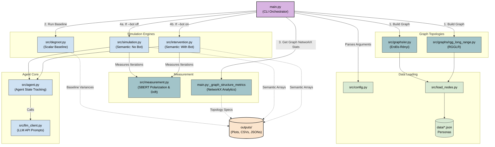

# Project Architecture & Run Flow

The following Mermaid diagram visualizes the structure of the ECE227 Final Project following our recent integrations. It demonstrates how `main.py` orchestrates the graph building, the baseline models, the semantic simulations, and the comprehensive metric logging.

## Key Workflows

1. **Initialization:** `main.py` parses arguments (run or matrix) and calls the graph builders (`er.py` or `rgg_long_range.py`). These builders use `load_nodes.py` to populate nodes with text personas from the `data` directory.
2. **DeGroot Baseline:** Before any LLM calls occur, `main.py` extracts the ideological blocks of the graph nodes, translates them to simple scalars using `config.py`, and runs the standard DeGroot consensus simulation via `degroot.py`.
3. **Semantic Semantic Execution:** Depending on the `--bot` flag, `main.py` hands the graph over to either `simulation.py` or `intervention.py`. 
4. **Agent Interaction:** During semantic execution, graph agents (`agent.py`) observe their neighbors and formulate new opinions by querying LLM models (`llm_client.py`).
5. **Continuous Measurement:** After each step, the execution loop sends all opinions to `measurement.py`, which uses SBERT to calculate `semantic_variance`, `opinion_polarization`, and `persona_drift`. 
6. **Data Aggregation:** Finally, `main.py` calculates structural centrality scores (`_graph_structure_metrics`) and dumps all arrays and properties to respective CSV files and `.png` charts in the `outputs/` directory.
