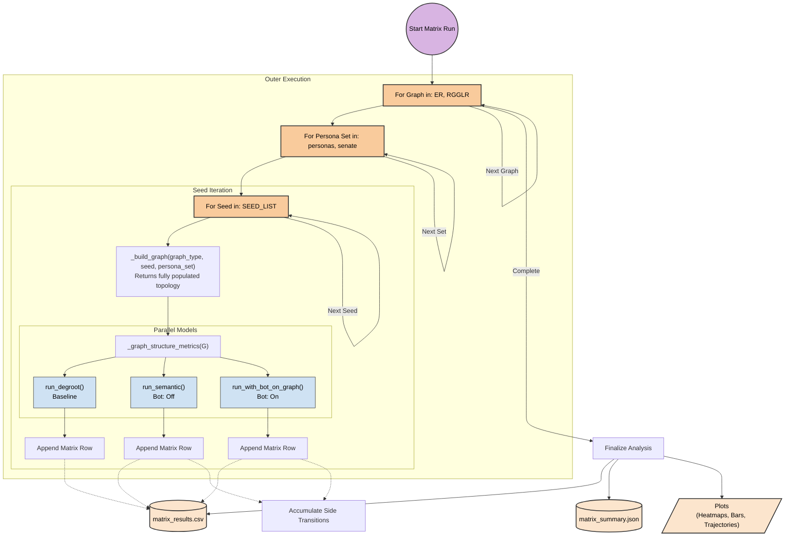

# Matrix Run Execution Loop

This diagram illustrates how `main_matrix` systematically sweeps through all permutations of Graph topology, Persona Data, and Initial random seed.

## Total Permutations
The script evaluates every combination automatically. With the defaults (2 graph types, 2 persona sets, 3 seeds), the script initializes **12 unique graphs**.

For each of those 12 graphs, it runs 3 separate simulation variations (DeGroot, Semantic No Bot, Semantic With Bot), producing **36 independent rows** in the final `matrix_results.csv` output.
